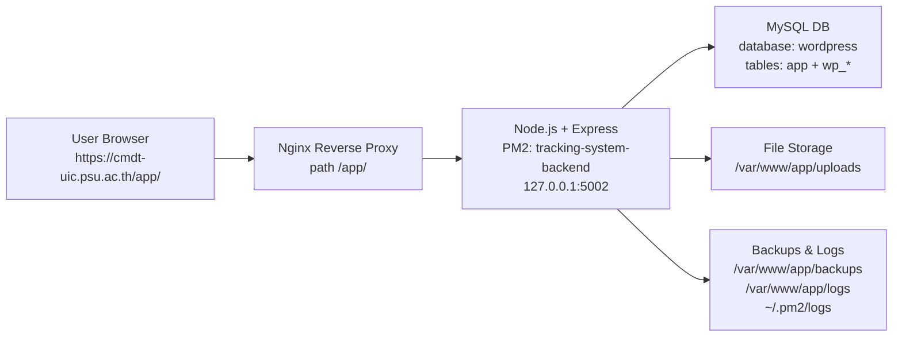

# Tracking System PSUIC - IT Handover + User Guide (3 Roles)

เอกสารฉบับเดียวสำหรับส่งมอบระบบให้ทีม IT องค์กรและใช้เป็นคู่มือใช้งานสำหรับผู้ใช้ใหม่ทุกบทบาท

- เอกสารนี้อ้างอิงสถานะระบบจริง ณ วันที่ 2 มีนาคม 2026
- Production URL: `https://cmdt-uic.psu.ac.th/app/`
- Backend runtime: `pm2` process ชื่อ `tracking-system-backend` (port `5002`)

---

## 1) Executive Summary (สรุปสำหรับผู้บริหาร/ผู้รับช่วง)

ระบบนี้เป็น Web Application สำหรับงานแจ้งปัญหาและติดตามงาน IT ภายใน PSUIC แบ่งผู้ใช้งานเป็น 3 บทบาท:

1. `user` (ผู้แจ้งปัญหา)
2. `it_support` (เจ้าหน้าที่ IT)
3. `admin` (ผู้ดูแลระบบ)

สถานะปัจจุบัน:

1. Login ด้วย Email/Password ใช้งานได้
2. PSU Passport ยังไม่เปิดใช้งานจริง (ต้องรออนุมัติ + ทำงานพัฒนาเพิ่ม)
3. ฐานข้อมูลของระบบถูกเก็บร่วมกับ DB ชื่อ `wordpress` (มีความเสี่ยงเชิงปฏิบัติการ ต้องควบคุมคำสั่งให้เข้มงวด)

---

## 2) System Architecture (โครงสร้างระบบ)



### 2.1 Runtime Components

1. Web entry: Nginx route `/app/`
2. App process: PM2 process `tracking-system-backend`
3. API endpoint: `/app/api/*` (ผ่าน proxy ไป backend)
4. Static files: `client/dist` + uploads

### 2.2 Key Paths on Server

1. Project root: `/var/www/app`
2. Upload files: `/var/www/app/uploads`
3. Upload backups: `/var/www/app/backups/uploads`
4. App logs: `/var/www/app/logs`
5. PM2 logs: `/home/psuic_admin/.pm2/logs`
6. Env production: `/var/www/app/.env.production`

---

## 3) Data & Storage Model (ข้อมูลถูกเก็บที่ไหน)

### 3.1 Database

1. DB connection มาจาก `DATABASE_URL` ใน `.env.production`
2. ปัจจุบันชี้ไป DB ชื่อ `wordpress`
3. DB นี้มีทั้ง:
   - ตารางระบบนี้ (เช่น `User`, `Ticket`, `Room`, `Equipment`, `Notification`, ฯลฯ)
   - ตาราง WordPress (`wp_*`)

### 3.2 File Storage

1. รูปจากการแจ้งปัญหาและไฟล์ที่เกี่ยวข้องเก็บใน `UPLOAD_DIR`
2. scheduler จะทำ backup/cleanup ตาม cron ใน env

### 3.3 Logging & Audit

1. Request logs/operation logs อยู่ใน `logs/out.log` และ `logs/error.log`
2. PM2 มี log แยกใน `~/.pm2/logs`

---

## 4) Access Control & Roles (สิทธิ์การเข้าถึง)

### 4.1 Roles

1. `user`: แจ้งปัญหา, ดูสถานะ, ดูประวัติ, ดูความรู้
2. `it_support`: รับงาน, อัปเดตสถานะ, ใส่ checklist/บันทึกการแก้ไข, แนบหลักฐาน, ดูตารางงาน
3. `admin`: จัดการผู้ใช้/สิทธิ์/หมวดหมู่/ห้อง/อุปกรณ์/ความรู้/รายงาน

### 4.2 Route Guard

1. `/user/*` เข้าได้เมื่อ login แล้ว
2. `/it/*` ต้อง role เป็น `it_support`
3. `/admin/*` ต้อง role เป็น `admin`

---

## 5) SOP สำหรับ IT Operations (งานดูแลระบบประจำ)

## 5.1 Daily SOP (ทุกวัน)

1. ตรวจว่า process ยัง online

```bash
cd /var/www/app
source ~/.bashrc
nvm use 20
pm2 status
```

2. ตรวจ log error ล่าสุด

```bash
pm2 logs tracking-system-backend --lines 100 --nostream
```

3. ตรวจ endpoint หลัก

```bash
curl -I https://cmdt-uic.psu.ac.th/app/
curl -I https://cmdt-uic.psu.ac.th/app/api/non-exist
```

## 5.2 Weekly SOP (ทุกสัปดาห์)

1. สำรอง DB แบบ manual เพิ่ม

```bash
cd /var/www/app
NODE_ENV=production node scripts/backup_db.js
```

2. ตรวจพื้นที่ดิสก์

```bash
df -h
du -sh /var/www/app/uploads /var/www/app/backups /var/www/app/logs
```

3. ตรวจ backup folder ว่ามีไฟล์ใหม่เข้าตาม schedule

## 5.3 Deployment / Update SOP

1. เข้าโฟลเดอร์ระบบและใช้ Node เวอร์ชันถูกต้อง

```bash
cd /var/www/app
source ~/.bashrc
nvm use 20
```

2. preflight ก่อน deploy (แนะนำ)

```bash
npm run preflight:prod
```

3. migrate schema (production)

```bash
npm run prisma:migrate:prod
```

4. build frontend

```bash
cd client
npm install
npm run build
cd ..
```

5. restart app

```bash
pm2 restart tracking-system-backend --update-env
pm2 status
```

## 5.4 คำสั่งที่ "ห้าม" รันบน Production

1. ห้ามรัน `npm run seed` บน production
2. เหตุผล: `seed` ของโปรเจกต์นี้ล้างข้อมูลตารางหลักของระบบก่อนใส่ข้อมูลตัวอย่าง

---

## 6) Incident Response & Rollback Runbook

## 6.1 ระดับเหตุการณ์

1. P1: ระบบเข้าไม่ได้/ผู้ใช้ทั้งหมดใช้งานไม่ได้
2. P2: บางฟังก์ชันเสียหายหลัก (เช่น สร้าง ticket ไม่ได้)
3. P3: UI/รายงานบางจุดผิดพลาดแต่ใช้งานหลักได้

## 6.2 Incident SOP (แบบสั้น ใช้จริงได้)

1. ยืนยันอาการ

```bash
curl -I https://cmdt-uic.psu.ac.th/app/
pm2 status
pm2 logs tracking-system-backend --lines 200 --nostream
```

2. ถ้า process ล้ม ให้ restart

```bash
pm2 restart tracking-system-backend --update-env
```

3. ถ้าพังหลัง deploy ล่าสุด ให้ rollback
   - rollback code/ไฟล์ deploy ไป version ก่อนหน้า (ตามวิธี deploy ขององค์กร)
   - restore DB เฉพาะเมื่อยืนยันว่ามี data corruption จริง

## 6.3 DB Rollback (ใช้เมื่อจำเป็นเท่านั้น)

1. หาไฟล์ backup ล่าสุดใน `/var/www/app/backups`
2. แจ้ง downtime window
3. restore ด้วย DBA/IT ที่มีสิทธิ์ MySQL
4. restart app และทดสอบ smoke test

## 6.4 Smoke Test หลังแก้ incident

1. เปิด `https://cmdt-uic.psu.ac.th/app/`
2. login ด้วย admin test account
3. เข้า `/app/admin`, `/app/it`, `/app/user` ตามสิทธิ์
4. ทดสอบสร้าง ticket 1 รายการ
5. ตรวจว่า IT เห็น ticket และเปลี่ยนสถานะได้

---

## 7) Risk Control (ป้องกันผลกระทบอนาคต)

## 7.1 ความเสี่ยงหลักปัจจุบัน

1. ใช้ DB ร่วมกับ WordPress (`wordpress`) ทำให้คำสั่งผิดพลาดอาจกระทบระบบอื่น
2. ผู้ดูแลบางบัญชีไม่มี `sudo` จึงเปลี่ยน nginx/system config เองไม่ได้
3. PSU Passport ยังไม่ครบวงจร (ฝั่ง backend route ยังไม่ถูก implement)

## 7.2 ข้อกำหนดควบคุม

1. แยก runbook production ออกจาก dev ชัดเจน
2. ห้ามใช้ `seed` บน production
3. ทุกครั้งก่อน migration สำรอง DB ก่อนเสมอ
4. วางแผนย้าย DB ไป schema/DB แยกเฉพาะระบบนี้เมื่อพร้อม

---

## 8) PSU Passport Cutover Checklist (สำหรับ IT + Dev หลังได้รับอนุมัติ)

> สถานะปัจจุบัน: ยังปิดใช้งาน
>
> - ปุ่ม PSU Passport ถูก disable ตาม env และ logic หน้า Login
> - หน้า callback ปัจจุบัน redirect กลับ login
> - frontend เตรียม function เรียก `/api/auth/psu-passport/callback` แต่ backend route ยังไม่มี

## 8.1 ข้อมูลที่ต้องขอจากศูนย์คอมมหาวิทยาลัย

1. `client_id`
2. `client_secret`
3. authorization endpoint
4. token endpoint
5. userinfo endpoint (ถ้ามี)
6. ขอบเขตสิทธิ์ (scope) ที่อนุญาต
7. redirect URI ที่อนุมัติ (ต้องตรงเป๊ะ):
   - `https://cmdt-uic.psu.ac.th/app/auth/callback`

## 8.2 งานที่ IT ต้องทำร่วมกับ Dev (Technical Tasks)

1. เพิ่ม backend endpoints:
   - `GET /api/auth/psu-passport/start`
   - `POST /api/auth/psu-passport/callback`
2. callback flow:
   - รับ `code` จาก PSU
   - แลก token กับ PSU OAuth server
   - ดึงข้อมูลผู้ใช้
   - upsert user ใน DB
   - map role ตาม policy องค์กร
   - ออก JWT ของระบบนี้
3. ปรับ frontend:
   - ปุ่ม PSU เรียก `initiatePSULogin()`
   - หน้า callback เรียก backend callback แล้ว login เข้าระบบจริง

## 8.3 Env ที่ต้องเพิ่ม/ปรับ

1. server env (แนะนำ)
   - `PSU_OAUTH_CLIENT_ID`
   - `PSU_OAUTH_CLIENT_SECRET`
   - `PSU_OAUTH_AUTH_URL`
   - `PSU_OAUTH_TOKEN_URL`
   - `PSU_OAUTH_USERINFO_URL`
   - `PSU_OAUTH_REDIRECT_URI=https://cmdt-uic.psu.ac.th/app/auth/callback`
2. client env
   - `VITE_PSU_PASSPORT_ENABLED=true`
   - `VITE_PSU_CLIENT_ID=...`
   - `VITE_PSU_REDIRECT_URI=https://cmdt-uic.psu.ac.th/app/auth/callback`

## 8.4 Test Checklist ก่อนเปิดจริง

1. Login ผ่าน PSU สำเร็จ (ผู้ใช้ใหม่)
2. Login ผ่าน PSU สำเร็จ (ผู้ใช้เดิม)
3. Role mapping ถูกต้อง (`user`/`it_support`/`admin`)
4. Logout แล้ว login ใหม่ได้
5. Email login เดิมยังใช้งานได้ (fallback)
6. ตรวจ log ว่าไม่มี OAuth error/timeout

## 8.5 Rollback Checklist (ถ้า PSU Passport มีปัญหา)

1. ปิด flag:
   - `VITE_PSU_PASSPORT_ENABLED=false`
2. deploy frontend + restart PM2
3. ให้ผู้ใช้กลับไปใช้ Email login ชั่วคราว
4. เปิด incident ticket และเก็บ log เวลาเกิดเหตุ

---

## 9) คู่มือใช้งานระบบสำหรับ 3 บทบาท (มือใหม่)

## 9.1 ขั้นตอนเริ่มต้นสำหรับทุกบทบาท

1. เปิดเว็บ `https://cmdt-uic.psu.ac.th/app/`
2. กด `Login with Email`
3. กรอกอีเมล/รหัสผ่าน
4. ระบบจะพาไปหน้าตาม role อัตโนมัติ

หมายเหตุ: ตอนนี้ปุ่ม PSU Passport ยังใช้งานไม่ได้

## 9.2 คู่มือ Role: User (ผู้แจ้งปัญหา)

### เมนูหลัก

1. `Home` หน้าแรกและทางลัด
2. `Report Issue` แจ้งปัญหา
3. `History` ประวัติงาน
4. `Schedule` ดูตารางงาน IT
5. `Knowledge` คู่มือแก้ปัญหาเบื้องต้น
6. `Profile` ข้อมูลผู้ใช้

### วิธีแจ้งปัญหา (Step-by-step)

1. เข้า `Report Issue`
2. กรอกหัวข้อปัญหา
3. เลือกหมวดอุปกรณ์ (Category)
4. เลือกชั้น/ห้อง
5. เลือกระดับความเร่งด่วน (Low/Medium/High)
6. กรอกรายละเอียดปัญหา
7. แนบรูป (ถ้ามี)
8. กดส่งคำขอ
9. ระบบขึ้นข้อความสำเร็จและเปิดหน้า ticket

### ติดตามสถานะงาน

1. เข้า `History` หรือหน้า Ticket รายตัว
2. ตรวจสถานะ เช่น `Not Start`, `In Progress`, `Completed`, `Rejected`

### ใช้ Knowledge (Quick Fix)

1. เข้า `Knowledge`
2. ค้นหาคำสำคัญ หรือกรองตามหมวด
3. เปิดหัวข้อเพื่อดูขั้นตอนแก้ปัญหา

## 9.3 คู่มือ Role: IT Support

### เมนูหลัก

1. `Home` Dashboard ภาพรวมงาน
2. `Tickets` รายการ ticket ทั้งหมด (กรองได้)
3. `History` ประวัติงานที่ทำแล้ว
4. `Schedule` ตารางงาน IT/งานส่วนตัว
5. `Notifications` การแจ้งเตือน
6. `Profile` ข้อมูล IT และการตั้งค่า

### วิธีรับงานและอัปเดตงาน

1. เข้า `Tickets`
2. กรองสถานะ/ชั้น/ห้อง
3. เลือก ticket ที่ต้องการ
4. เปิดหน้า `Ticket Detail`
5. อ่านข้อมูลปัญหาและรูปที่แนบ
6. เปลี่ยนสถานะงานตามจริง
7. เพิ่ม checklist / note การแก้ไข
8. แนบหลักฐานหลังแก้ (ถ้ามี)
9. กดบันทึกและปิดงานเมื่อเสร็จ

### งานที่ IT ควรทำทุกวัน

1. เปิดดู `Not Start` และ `In Progress`
2. อัปเดต ticket ที่ค้าง
3. ตรวจ notifications
4. ทบทวน schedule ประจำวัน

## 9.4 คู่มือ Role: Admin

### เมนูหลัก

1. `Home` Dashboard ผู้ดูแลระบบ
2. `Users` จัดการผู้ใช้และ role
3. `Manage Rooms` จัดการห้อง
4. `Manage Categories` จัดการหมวดอุปกรณ์
5. `Manage Equipment` จัดการอุปกรณ์ + QR
6. `Reports` รายงานสถิติ
7. `Permission` ตั้งสิทธิ์ role
8. `Knowledge Base` จัดการบทความ Quick Fix
9. `Profile` ข้อมูลผู้ดูแล

### งานประจำของ Admin

1. สร้าง/แก้ไขผู้ใช้ และกำหนด role ให้ถูกต้อง
2. ตรวจความครบถ้วนของห้อง/อุปกรณ์/หมวดหมู่
3. ดูรายงานแนวโน้ม ticket
4. จัดการ permission เมื่อมีนโยบายใหม่
5. อัปเดต Knowledge Base ให้ทันปัญหาที่เจอบ่อย

### คำเตือนสำคัญสำหรับ Admin

1. หลีกเลี่ยงการลบข้อมูลโดยไม่ backup
2. เปลี่ยน role ผู้ใช้เฉพาะที่ได้รับอนุมัติ
3. ห้ามใช้คำสั่ง production ที่ไม่อยู่ใน SOP

---

## 10) Troubleshooting สำหรับผู้ใช้งานทั่วไป

1. Login ไม่ได้:
   - ตรวจอีเมล/รหัสผ่าน
   - ลองรีเฟรชและ login ใหม่
   - ถ้ายังไม่ได้ ให้ติดต่อ IT พร้อม screenshot และเวลาเกิดเหตุ
2. รูปไม่ขึ้น:
   - กด Hard Reload (`Cmd+Shift+R` หรือ `Ctrl+F5`)
3. หน้าเว็บค้าง:
   - logout แล้ว login ใหม่
   - ลอง browser อื่น
4. สร้าง ticket ไม่สำเร็จ:
   - ตรวจว่ากรอกช่องบังคับครบแล้ว
   - ลดขนาดรูปแนบ

---

## 11) IT Command Cheat Sheet (Copy/Paste)

### ตรวจระบบเร็ว

```bash
cd /var/www/app
source ~/.bashrc
nvm use 20
pm2 status
pm2 logs tracking-system-backend --lines 80 --nostream
curl -I https://cmdt-uic.psu.ac.th/app/
```

### Deploy มาตรฐาน

```bash
cd /var/www/app
source ~/.bashrc
nvm use 20
npm run preflight:prod
npm run prisma:migrate:prod
cd client && npm install && npm run build && cd ..
pm2 restart tracking-system-backend --update-env
pm2 status
```

### Backup DB ทันที

```bash
cd /var/www/app
source ~/.bashrc
nvm use 20
NODE_ENV=production node scripts/backup_db.js
```

---

## 12) Governance Notes สำหรับองค์กร (สำคัญ)

1. Production ปัจจุบันใช้ DB ร่วมกับ `wordpress` จึงต้องควบคุม change อย่างเข้มงวด
2. ควรจัดทำแผนแยก DB สำหรับระบบนี้ในระยะถัดไป
3. ควรมี change ticket ทุกครั้งก่อน deploy และมี rollback plan แนบเสมอ
4. สำหรับ PSU Passport ให้ถือว่าเป็นโครงการย่อยแยก (มี UAT + security review ก่อนเปิดจริง)

---

## 13) Sign-off Template (ใช้ตอนส่งมอบ)

1. ระบบออนไลน์ที่ `https://cmdt-uic.psu.ac.th/app/`
2. IT รับทราบ SOP deploy/backup/incident แล้ว
3. IT รับทราบข้อห้าม `npm run seed` บน production แล้ว
4. IT รับทราบว่า PSU Passport ยังไม่เปิดใช้งานจริงและต้องทำ cutover ตาม checklist
5. ผู้ส่งมอบและผู้รับมอบลงชื่อพร้อมวันที่

---

สิ้นสุดเอกสาร
