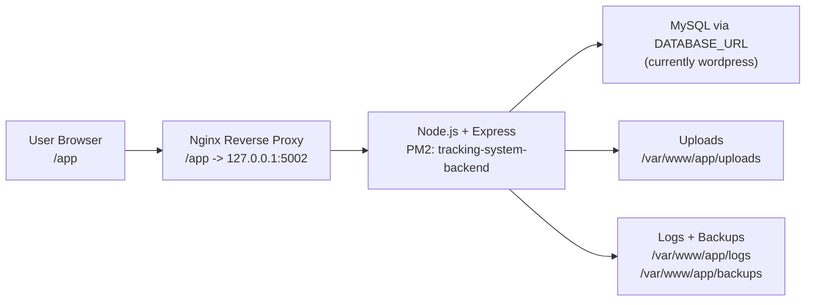

# เอกสารส่งมอบระบบ + บำรุงรักษา + PSU Passport Cutover (ฉบับ IT)

อัปเดตล่าสุด: 3 มีนาคม 2026  
ระบบ: Tracking System PSUIC  
Production URL: `https://cmdt-uic.psu.ac.th/app/`  
Process Runtime: `pm2` ชื่อ `tracking-system-backend`  
Backend Port: `5002`

## 1) สถานะระบบ ณ วันส่งมอบ

1. ระบบ 3 บทบาท (`user`, `it_support`, `admin`) ใช้งานได้
2. Login แบบ Email/Password ใช้งานได้
3. PSU Passport ยังไม่เปิดใช้งานจริงใน production
4. ระบบมีฟังก์ชันแจ้งเตือนอีเมลและ Google Calendar แต่ขึ้นกับการตั้งค่า env ฝั่ง server
5. ระบบใช้ฐานข้อมูลตาม `DATABASE_URL` (production ปัจจุบันชี้ DB ชื่อ `wordpress`)

## 2) สถาปัตยกรรมระบบ (Production)



## 3) โครงสร้างสำคัญบนเซิร์ฟเวอร์

1. Project root: `/var/www/app`
2. Frontend build: `/var/www/app/client/dist`
3. App logs: `/var/www/app/logs`
4. PM2 logs: `/home/psuic_admin/.pm2/logs`
5. Backups: `/var/www/app/backups`
6. Env production: `/var/www/app/.env.production`

## 4) คำสั่ง Deploy มาตรฐาน (รันทีละบรรทัด)

```bash
cd /var/www/app
source ~/.bashrc
nvm use 20

npm run preflight:prod
npm run prisma:migrate:prod
npm run prisma:generate:prod

cd client
npm run build
cd ..

pm2 restart tracking-system-backend --update-env
pm2 save
pm2 status
```

หมายเหตุ:

1. หากเครื่องไม่มี `git` หรือไม่มีสิทธิ์ `sudo` ให้ใช้ workflow ส่งไฟล์ (`scp/rsync`) แทน
2. ห้ามแก้ nginx/system package หากไม่มีสิทธิ์บัญชี sudo

## 5) ตรวจระบบหลัง Deploy (Smoke Test)

```bash
curl -I http://127.0.0.1:5002/app/
curl -I https://cmdt-uic.psu.ac.th/app/
curl -i https://cmdt-uic.psu.ac.th/app/api/non-exist
pm2 status
```

ผ่านเมื่อ:

1. `/app/` ตอบ `HTTP 200`
2. API path ที่ไม่มีจริงตอบ `404` JSON
3. PM2 แสดง `tracking-system-backend` สถานะ `online`

## 6) การตั้งค่า Email Notification (Server)

ต้องมีค่าใน `.env.production`:

1. `MAIL_USER`
2. `MAIL_PASS`

คำสั่งตรวจ SMTP:

```bash
cd /var/www/app
source ~/.bashrc
nvm use 20
npm run smtp:verify:prod
```

พฤติกรรมจริงของระบบ:

1. IT สามารถบันทึก notification email ของตัวเองได้แม้ SMTP ยังไม่พร้อม
2. การส่งเมลจะเกิดตอนมีการสร้าง Ticket ใหม่
3. ผู้รับเมลคือเฉพาะบัญชี `it_support` ที่เปิดแจ้งเตือนและมี `notificationEmail` ถูกต้อง

## 7) การตั้งค่า Google Calendar (Server)

ต้องมีค่าใน `.env.production`:

1. `GOOGLE_PROJECT_ID`
2. `GOOGLE_CLIENT_EMAIL`
3. `GOOGLE_PRIVATE_KEY`

คำสั่งตรวจ Google config:

```bash
cd /var/www/app
source ~/.bashrc
nvm use 20
npm run check:google:prod
```

พฤติกรรมจริงของระบบ:

1. IT สามารถบันทึก Calendar ID ได้ แม้ server key ยังไม่ครบ
2. ถ้า key ยังไม่ครบ ระบบจะแจ้ง missing keys
3. เมื่อ key ครบ ระบบจะ sync ตารางงานได้จากหน้า `/it/schedule`

## 8) ขั้นตอนย้าย Google Private Key จากเครื่องเก่า -> เครื่องใหม่

ใช้เมื่อ production ใหม่ยังไม่มี `GOOGLE_PRIVATE_KEY`

1. ที่เครื่องเก่า เปิดไฟล์ `.env.production` และคัดลอกค่า `GOOGLE_PRIVATE_KEY` ทั้งบรรทัด (รวมเครื่องหมาย quote)
2. ที่เครื่องใหม่ วางค่าลง `.env.production` ของโปรเจกต์เดียวกัน
3. ตรวจว่ารูปแบบ key ยังเป็น PEM ถูกต้อง (`BEGIN PRIVATE KEY` ถึง `END PRIVATE KEY`)
4. รันคำสั่งตรวจ:

```bash
npm run validate:env:file:prod
npm run check:google:prod
```

5. รีสตาร์ตระบบ:

```bash
pm2 restart tracking-system-backend --update-env
pm2 save
```

ข้อควรระวัง:

1. ห้าม commit ค่า private key ขึ้น GitHub
2. จำกัดสิทธิ์ไฟล์ env ให้เฉพาะผู้ดูแลระบบ

## 9) SOP บำรุงรักษาระบบ

## 9.1 Daily

```bash
cd /var/www/app
source ~/.bashrc
nvm use 20
pm2 status
pm2 logs tracking-system-backend --lines 100 --nostream
```

## 9.2 Weekly

```bash
cd /var/www/app
npm run uploads:backup
npm run uploads:cleanup
npm run logs:rotate
```

## 9.3 Monthly

1. ตรวจพื้นที่ disk ของ `uploads`, `logs`, `backups`
2. ทดสอบ restore backup แบบตัวอย่าง
3. ทบทวนบัญชีผู้ใช้และสิทธิ์ role

## 10) Incident / Rollback Runbook

## 10.1 ตรวจอาการเบื้องต้น

```bash
pm2 status
pm2 logs tracking-system-backend --lines 200 --nostream
curl -I https://cmdt-uic.psu.ac.th/app/
```

## 10.2 แก้เหตุเร่งด่วน

```bash
pm2 restart tracking-system-backend --update-env
```

## 10.3 Rollback เวอร์ชัน

1. ย้อนโค้ดหรือไฟล์ deploy ไป release ก่อนหน้า
2. build frontend ใหม่ตามเวอร์ชันที่ rollback
3. restart PM2
4. ทดสอบ smoke test ซ้ำ

## 10.4 Rollback ฐานข้อมูล

ทำเฉพาะเมื่อยืนยัน data corruption จริง และต้องผ่าน DBA/IT ที่รับผิดชอบฐานข้อมูลร่วม

## 11) ข้อห้ามบน Production (สำคัญ)

1. ห้ามรัน `npm run seed`
2. ห้ามรัน `npm run db:reset`
3. ห้ามรันคำสั่งล้างข้อมูลแบบเหมารวมโดยไม่มี backup

เหตุผล:

1. สคริปต์ seed ของโปรเจกต์มีขั้นตอนล้างข้อมูลก่อนเติมข้อมูลตัวอย่าง
2. production ปัจจุบันใช้ DB ร่วม (`wordpress`) ซึ่งอาจกระทบระบบอื่นได้

## 12) สถานะ PSU Passport ปัจจุบัน

ณ วันที่ 3 มีนาคม 2026:

1. หน้า Login แสดงปุ่ม PSU Passport แต่ยังไม่ใช้งานจริง
2. หน้า `/auth/callback` ปัจจุบันแจ้งเตือนและพากลับ `/login`
3. Backend ยังไม่มี route callback ที่ใช้งานจริงสำหรับ PSU OAuth

สรุป: production ต้องใช้ `Login with Email` เป็นช่องทางหลัก

## 13) PSU Passport Cutover Checklist (เมื่อศูนย์คอมอนุมัติ)

## 13.1 สิ่งที่ต้องได้รับจากศูนย์คอม

1. OAuth Client ID
2. OAuth Client Secret
3. Authorization URL
4. Token URL
5. UserInfo endpoint (ถ้ามี)
6. Redirect URI ที่ลงทะเบียนแล้ว

## 13.2 งานที่ Dev/IT ต้องทำ

1. ทำ backend endpoint สำหรับเริ่ม OAuth และ callback
2. ตรวจสอบ token กับ PSU OAuth
3. map identity -> user ในฐานข้อมูล
4. กำหนด role mapping policy
5. ออก JWT ของระบบนี้
6. เก็บ Email login เป็น fallback

## 13.3 ค่า env ที่ต้องใช้

Frontend:

1. `VITE_PSU_PASSPORT_ENABLED=true`
2. `VITE_PSU_CLIENT_ID=<client-id>`
3. `VITE_PSU_REDIRECT_URI=https://cmdt-uic.psu.ac.th/app/auth/callback`

Backend:

1. PSU OAuth credentials ตามที่อนุมัติ
2. callback/security settings ที่ตรงกับ PSU policy

## 13.4 UAT ก่อนเปิดจริง

1. ผู้ใช้ใหม่ login PSU สำเร็จ
2. ผู้ใช้เดิม login PSU สำเร็จและ role ถูกต้อง
3. IT/Admin login และเข้าหน้าของ role ตนได้
4. Email login เดิมยังใช้งานได้
5. ทดสอบกรณี error (code หมดอายุ, token ไม่ผ่าน, callback ผิด)

## 13.5 Rollback หาก PSU Passport มีปัญหา

1. ปิด `VITE_PSU_PASSPORT_ENABLED=false`
2. build frontend ใหม่
3. restart PM2
4. ประกาศ fallback เป็น Email login

## 14) เอกสารที่ส่งมอบพร้อมระบบ

1. `docs/MANUAL_USER_TH.md`
2. `docs/MANUAL_IT_TH.md`
3. `docs/MANUAL_ADMIN_TH.md`
4. `docs/HANDOVER_MAINTENANCE_PSU_PASSPORT_TH.md`
5. `docs/HANDOVER_RELEASE_CHECKLIST_TH.md`

## 15) Sign-off Checklist

```text
โครงการ: Tracking System PSUIC
วันที่ส่งมอบ: __________________
ผู้ส่งมอบ (Dev): __________________
ผู้รับมอบ (IT): __________________

[ ] ระบบเปิดใช้งานที่ https://cmdt-uic.psu.ac.th/app/ ได้
[ ] PM2 process online และ save แล้ว
[ ] คู่มือ User/IT/Admin ถูกส่งมอบแล้ว
[ ] Runbook Deploy/Incident/Rollback ถูกส่งมอบแล้ว
[ ] รับทราบข้อห้าม seed/db reset บน production แล้ว
[ ] รับทราบสถานะ PSU Passport (ยังไม่เปิดจริง) แล้ว
[ ] รับทราบแผน Cutover PSU Passport แล้ว
```
